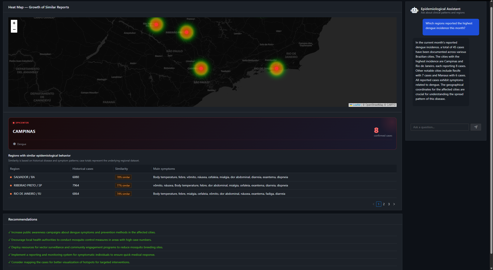

# 
 > Transform healthcare data into actionable insights through natural language conversations, geospatial visualization, and AI-assisted epidemiological investigation.

## 📋 About

EpInsights is an intelligent epidemiological analysis platform designed to help healthcare professionals, researchers, and public health teams explore FHIR-based clinical data through a conversational interface.

Instead of manually querying databases or navigating complex healthcare records, users can ask questions in natural language and receive answers grounded in real FHIR resources and epidemiological datasets.

# 

## ✨ Features

Ask questions such as:

- "Show scorpion sting cases by state in the last 30 days"
- "Which regions reported the highest dengue incidence this month?"
- "Are there any active COVID-19 clusters right now?"

The AI agent translates questions into validated queries and retrieves data directly from FHIR resources.

- 💬 **Conversational Interface** —et-based visualization of disease distribution across regions
- 🔍 **Hybrid Search** — Combines FHIR SQL execution with semantic vector search for richer answers
- 🤖 **AI Agent (LangChain4j)** — Intelligent agent that decides when to query FHIR SQL vs. vector store
- 🏥 **FHIR R4 Compliant** —  Ask epidemiological questions in natural language, maintaining session context via `chatId`
- 🗺️ **Geospatial Heatmaps** — LeaflBuilt on top of InterSystems IRIS for Health FHIR repository


🔒 Controlled Data Access

For safety and auditability:

- The AI agent never executes arbitrary SQL.
- All database access is mediated through predefined tools.
- Queries are validated before execution.
- Results are generated exclusively from real healthcare data.

This approach follows the same principle used by modern healthcare AI systems that rely on controlled FHIR access instead of unrestricted database interaction.


## 🚀 Getting Started
EpInsights is fully containerized and can be started locally using Docker Compose.

### ✅ Prerequisites 

  - Make sure you have the following installed:
    - 🔗 git  
    - 🐳 Docker  
    - 🧩 Docker Compose  
    - 🔑 An OpenAI API key

### 📂 Clone the Repository

```bash
git clone https://github.com/luanavma/epi-insights.git
```

### 🧬 Generate Synthetic FHIR Data

Before starting the application, generate the synthetic FHIR dataset used by EpInsights.

```bash
cd epi-insights/iris
```


* Create a Python virtual environment:

```bash
python3 -m venv venv
```

* Activate the virtual environment:

```bash
source venv/bin/activate
```

* Install the required dependency:

```bash
pip install faker
```

* Generate the synthetic dataset:

```bash
python seed.py --patients 500 --output ./data --days 45 --seed 42
```

This command creates a synthetic epidemiological FHIR dataset that will be automatically loaded into InterSystems IRIS during the container build process.


### ⚙️ Configure Environment Variables 

 - Before starting the stack, from the project root directory, create your .env to define the `OPENAI_API_KEY` environment variable on your machine. Inside your epi-insights directory, run:

    ```bash
   cp .env.example .env
    ```
 - Inside your new .env file, insert your `OPENAI_API_KEY`

    ```bash
    OPENAI_API_KEY=your_openai_api_key_here
    ```

### ⚡ Start the Application

- From the project root directory, run:

    ```bash
      docker compose up --build
    ```
The first startup may take several minutes while Docker downloads the required images.

- Docker Compose will automatically:

  - 🟦 Build and start the InterSystems IRIS container
  - ⏳ Wait for IRIS to become healthy
  - 🖥️ Start the Quarkus backend (AI agent + SQL analytics)
  - 🗄️ Start the Angular frontend (conversational UI)


### 🌐 Accessing the Services 

- Once the stack is running:
  - 🤖 **Frontend (Conversational UI):** <http://localhost:4200>
  - 📊 **Backend API (Quarkus / Swagger UI):** <http://localhost:8080/swagger-ui/>
  - 🗄️ **InterSystems IRIS Management Portal:** -> <http://localhost:52773/csp/sys/UtilHome.csp>


## Architecture


1. Synthetic FHIR Data Layer
Patient bundles with ICD-10 and SNOMED CT coded conditions, symptom observations, and geolocated encounters are loaded into the InterSystems IRIS for Health FHIR repository, providing the clinical foundation for all analysis.
2. Regional Clinical Vectorization [Embedded Python + Vector Search]
Embedded Python runs natively inside IRIS to aggregate clinical features per region over a rolling 30-day window. Features are hashed into a 384-dimensional vector, normalized, and stored using IRIS Vector Search capabilities. This enables VECTOR_COSINE similarity queries that identify cities with epidemiologically similar profiles.
3. Disciplined AI Agent with Tool Calling [LangChain4j + Quarkus]
The conversational agent never guesses. Every question passes through a terminology discovery step that reads real codes from the FHIR repository before SQL is generated. The SQL builder follows strict FHIR-aware rules. The validator compiles every query against the live IRIS instance before execution. All answers come from real data.
4. Conversational Epidemiological Interface [Angular]
A live dashboard that responds to natural language questions. Each answer updates the heatmap, the epicenter panel, and the similar regions table — the last powered by Vector Search — in a single conversational turn.

## Authors

- [Davi Massaru Teixeira Muta](https://community.intersystems.com/user/davimassaru-teixeiramuta)
  - Linkedin: https://www.linkedin.com/in/davimassarumuta/
  - Github: https://github.com/Davi-Massaru
  - intersystems community: https://community.intersystems.com/user/davimassaru-teixeiramuta

- [Luana Vieira Machado]()
  - Linkedin: https://linkedin.com/in/luana-vieira-machado
  - Github: https://github.com/luanavma/
  - intersystems community: https://community.intersystems.com/user/luana-machado
